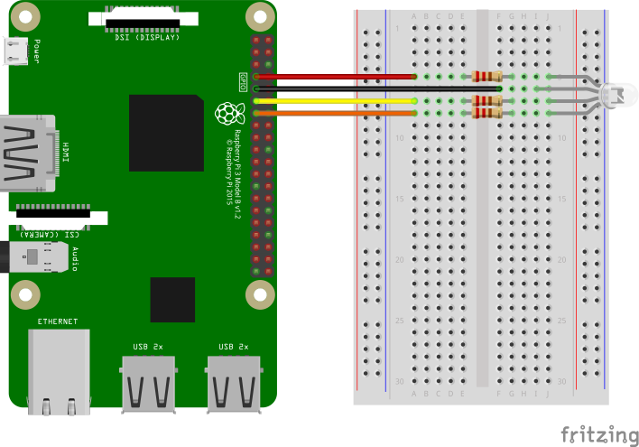

# Full-Stack IoT Demonstration

The purpose of this repository is to demonstrate a full-stack IoT solution using the following technologies:

- Raspberry Pi
- Amazon Alexa
- NodeJs
- AWS Lambda

## Raspberry Pi

In this probject, we will connect an LED to a Raspberry Pi. We will wire an RGB LED to the RPi and change the color using commands sent from Alexa and/or a front-end application. Because we will be utilizing an RGB LED, we will need to utilize PWM (Pulse-width modulation).

### Materials

In order to implement the RPi setup, you will need the following components:

- A Raspberry Pi running Raspbian, SSH, and Node.js.
- The [pigpio module](https://www.npmjs.com/package/pigpio) for Node.js.
- A Breadboard.
- Three 220 Ohm resistors.
- One RGB LED (this tutorial uses a common cathode).
- Four female-to-male jumper wires.

Note: [This kit](https://www.amazon.com/dp/B01ERPEMAC/ref=cm_sw_r_tw_dp_U_x_7J4CEb4HV4TNT) on Amazon has all of the components that you need (and more) and is pretty cheap!

### Installing pigpio

We will be using the Node.js *pigpio* wrapper, which provides the ability to interact with PWM (pulse-width-modulation) components from our code on the RPi. The install, run the following commands in the given order:

First update the package repository's lists:

```pi@raspberrypi:~ $ sudo apt update```

Next, install the C library on top of which the Node.js pigpio wrapper is built:

```pi@raspberrypi:~ $ sudo apt install pigpio```

Finally, install the wrapper:

```pi@raspberrypi:~ $ npm i pigpio```

Note: When running code that utilizes the pigpio library, you will need root/sudo privileges. This is because the wrapper uses the underlying C library.

### Building the circuit

In order to get our Node.js code to control the LED via PWM, we first need to wire up the LED on a breadboard. The diagram below demonstrates how things should be wired.

