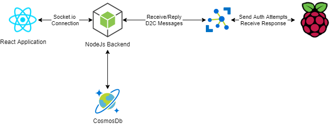

# Full-Stack IoT Demonstration

## Introduction

The purpose of this repository is to demonstrate to RSI colleagues (and all of the Internet) ways in which a developer can build a full-stack IoT solution using various technologies.

To present a real-world example, I will demonstrate how to utilize an RFID/NFC scanner attempt to authenticate a scanned fob by communicating with the cloud. The scans will instantaneously appear in a log shown on a React application.

## Technologies

Below you will find a list of technologies used in this implementation:

### Cloud

- AWS IoT Core - We will be using AWS IoT Core to manage our "Things" and provide ways in which our device can publish telemetry and consumers can subscribe to these payloads.

### Web Application

- React.js - The front-end will utilize React to provide a SPA for our demo app.
- Socket.io-client - Since updates from our back-end shall be distributed to the front-end immediately (without constant polling), we want to utilize the WebSocket protocol. Socket.io will provide us with this capability in a nice Managed library.

### Backend

- Node.js - Since our front-end is 100% JavaScript, what better than to use JavaScript on the back-end as well? The back-end will provide both a RESTful API and socket.io connectivity for our React app. This layer is also tasked with reading from the Event Hubs data produced by IoT Hub.

### Device

- Python - We will utilize a Python appplication on our Raspberry Pi to communicate with the hardware components. This layer will report data to Azure IoT Hub via the Azure SDK.
- Raspberry Pi - I'll be using a RPi to communicate with the physical hardware from which IoT Hub telemetry is produced.
- PN532 - I will use a PN532 to provide a hardware input. This will allow users to scan an RFID tag and validate the information in Azure.
- LED - I will use a single LED to provide a hardware output. This will allow us to provide visible feedback regarding a pass/fail of the PN532 tag validation.

## Architecture

As illustrated in the image below, the RPi is tasked with capturing authentication attempts from users using a physical MiFare card. The corresponding authentication information is JSON-serialized and sent to IoT Hub as a Message. This message is then intercepted by the listening Node.js application, which validates the authentication information against the corresponding record in the CosmosDB database.

The outcome of the validation (pass or fail) is sent back to the RPi via a C2D message. Additionally, the attempt (and the outcome) are sent to the Socket.io-connected React application.



## Setup

### AWS IoT Core Setup

One of the first things that you will need to do is to create an IoT Core Thing. In order to perform the appropriate tasks for this, please read the documentation [here](https://docs.aws.amazon.com/iot/latest/developerguide/register-device.html).

You will need the following permissions in the policy that you attach to the thing:

- TBD
- TBD
- TBD

### Raspberry Pi

#### Environment Variables

You will need to add the following environment variables to ```/etc/profile``` (or whereever your environment variables are pulled from):